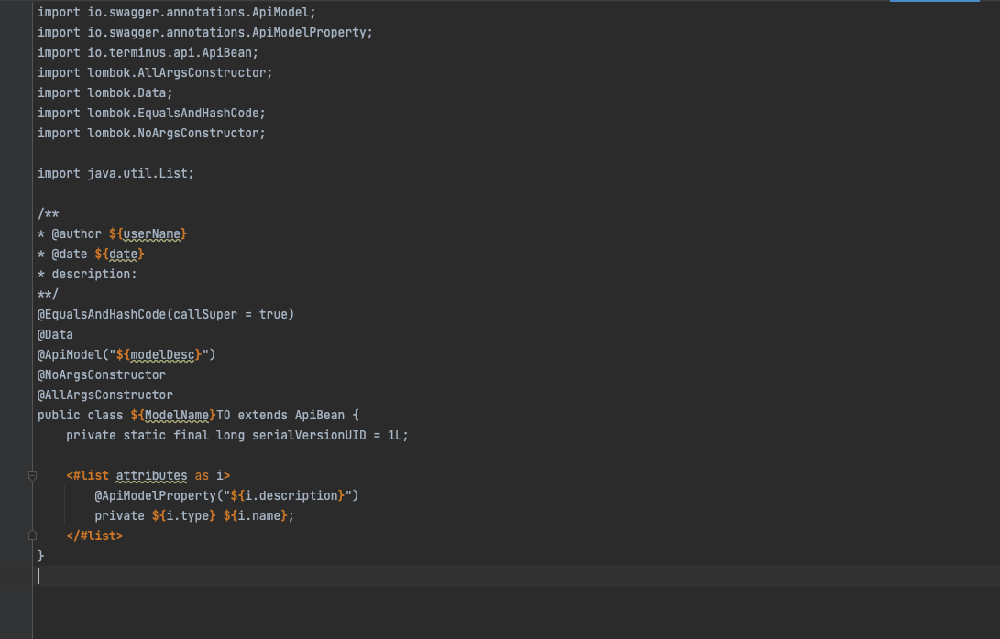
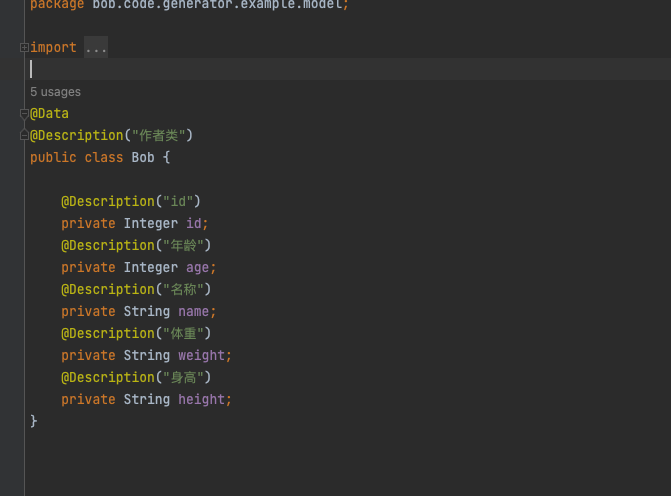

# code-generator
## 背景
在普通的网络传输中需要对模型进行多次 convert, 不同公司、不同项目使用架构不同似乎是一种不可能的事情。但有没有一种可能,当前项目比较持久或是项目刚开始阶段,是不是可以使用一套简单的模型转化, 可以以代码自动生成的方式去提升我们的效率。

## 内容
1. 基于 freeMark 的功能生成代码模版 , 不依赖 Spring 相关
2. 使用指令模式封装了对模型解析的处理,可适应需要
3. 其他使用案例可参照 terminus 分支
## 使用案例
官方: http://freemarker.foofun.cn/
### example 模版

### 解析效果
