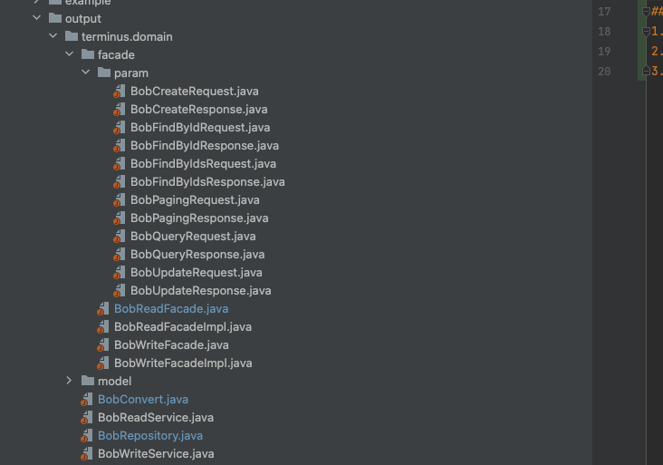

# code-generator
## 背景
在普通的网络传输中需要对模型进行多次 convert, 不同公司、不同项目使用架构不同似乎是一种不可能的事情。但有没有一种可能,当前项目比较持久或是项目刚开始阶段,是不是可以使用一套简单的模型转化, 可以以代码自动生成的方式去提升我们的效率。

## 内容
1. 基于 freeMark 的功能生成代码模版 , 不依赖 Spring 相关
2. 根据 PO 自动生成 TO、Repository、Manager、Service、Facade、Convert 等领域层基础功能
3. **目前功能只适配 terminus 功能, 若其他同学希望使用 freeMark 写自己的 code generate 可参考 example**
4. 🚀🚀🚀🚀 欢迎提 mr 或者有新需要告诉作者

## 使用案例
官方: http://freemarker.foofun.cn/
### 模版类

### 生成效果

### 推荐使用方式
1. 参考 bob.code.generator.example.model.Bob 写出自己的 PO 模型
2. 执行 bob.code.generator.terminus.TerminusApplication
3. 将 outPut 下的文件**复制**到公司项目目录结构 ( 解释: 生成的文件不含有包路径,复制过去后在点开文件 idea 会自动 set package 路径并自动引入其他类依赖, 当人需要提前打开 idea 的 autoImport )